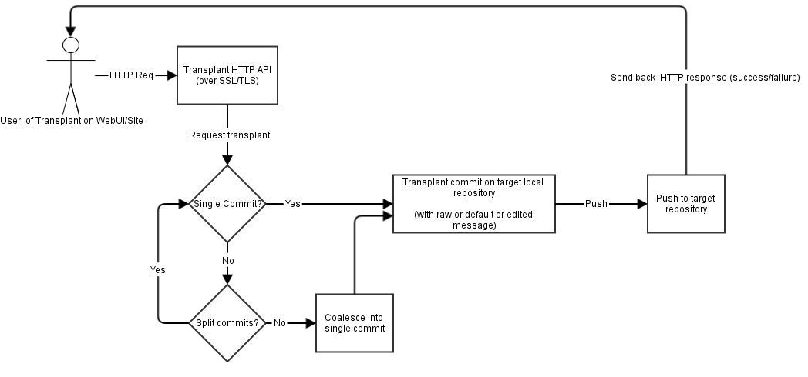

transplant
==========

A tool for transplanting commits between Mercurial repositories.

Overview
--------

Transplant tool has access to a number of preconfigured repositories and
can transplant (cherry-pick) arbitrary commits between them.

If more than one commit is transplanted in one go, there's an option to
squash them into one.


Architecture
------------

* Frontend - static files after build:
  * static HTML
  * CSS: [Bootstrap](http://getbootstrap.com/)
  * JavaScript:
    * [React](http://facebook.github.io/react/)
    * [Browserify](http://browserify.org/)
    * [Traceur](https://github.com/google/traceur-compiler)
      for some ES6 features like fat arrow functions
    * [gulp](http://gulpjs.com/) to put it all together

* Backend:
  * HTTP (REST) API powered by [Flask](http://flask.pocoo.org/)
  * Mercurial operations are performed in [Celery](http://www.celeryproject.org/) workers

Transplant tool has a local clone of each preconfigured repository.
Pulling and pushing is performed via SSH using a dedicated key.

Pulling is lazy, which means that transplant tool will perform a pull
only when the read operation (e.g. looking up a commit by id) failed
on existing local repository.

Some repositories are to big to clone or pull unconditionally
(i.e. has too many heads, like try), so we're using a base repository
to bootstrap them, then lazily pull only those revisions that we're interested in.

In case of try, we're initially cloning mozilla-central, then pulling from
try with `--rev` option.

**The usual flow looks like this:**



1. Receive request via HTTP API
2. For each item to transplant
  1. If the item is a single commit:
    1. Transplant that commit
    2. Optionally rewrite the commit message
  2. If the item is a revset (multiple commits):
    1. Get the list of commits in that revset
    2. Transplant each of those commits, one by one
    3. Collapse all transplanted commits into one
    (using either default or custom commit message)
3. Push the destination repository
4. If any of the above fails with exception, clean up the destination repository:

  ```
  hg update --clean
  hg purge --abort-on-err --all
  hg strip --rev('outgoing(default)')
  ```

5. Return the results in HTTP response

**The following Mercurial extensions are used:**

* [transplant](http://mercurial.selenic.com/wiki/TransplantExtension) -
does the actual heavylifting
* [purge](http://mercurial.selenic.com/wiki/PurgeExtension) -
used to clean up repositories after merge conflicts or other failures
* [strip](http://mercurial.selenic.com/wiki/StripExtension) -
same as purge
* [collapse](http://mercurial.selenic.com/wiki/CollapseExtension) (vendored) -
used to squash multiple commits into one


Requirements
------------

* Python 2.7 + pip
* RelengAPI 1.0.0+
* Mercurial 3.1.1+
* Properly configured SSH access to source and destination repositories
* Vagrant (development only)


Development
-----------

1. Add the following lines to `/etc/hosts`:

    ```
    # transplant
    10.0.32.2      transplant.dev
    ```

2. Run the following commands:

    ```
    vagrant up
    vagrant ssh
    cd /vagrant
    honcho start
    ```

3. Open [http://transplant.dev:8010/transplant/transplant](http://transplant.dev:8010/transplant/transplant).
4. If you see `405 Method Not Allowed`, then it works.


REST API
--------

The endpoint for performing transplants is `/transplant/transplant`.
It expects a JSON structure to be posted with three fields:

* The `src` field is the source repository.
* The `dst` field is the destination repository.
* The `items` field is an array of items to be transplanted from source to destination repository.

Each item can be:

1. A single commit, e.g.

  ```json
  {
    "commit": "530deede29af",
    "message": "(optional) override commit message"
  }
  ```

2. A *plus-separated* list of commits that will be squashed, e.g.

  ```json
  {
    "revset": "4c6efadbb0e0 + 035d8c4536cc + 4095850df1d8",
    "message": "(optional) squashed commits message"
  }
  ```

  **Please note: future versions may use an actual array instead of a plus-separated list.**

Full example:

```json
{
  "src": "mozilla-central",
  "dst": "mozilla-aurora",
  "items": [
    {
      "commit": "530deede29af"
    },
    {
      "commit": "89056c67ff86",
      "message": "new commit message"
    },
    {
      "revset": "c4b79128d2ef::a72b444f86ac",
      "message": "transplanted commits between c4b79128d2ef and a72b444f86ac"
    }
  ]
}
```

The `Content-Type` request header must be set to `application/json`.

In response, you'll receive a task ID, e.g.

```json
{
    "result": {
        "task": "e2167b61-d259-4b74-b3ad-b48743a60269"
    }
}
```

Use this task ID to get the result of transplant by querying `/transplant/result/<task_id>`, e.g.

Request: `GET /transplant/results/e2167b61-d259-4b74-b3ad-b48743a60269`

Resonse:
```json
{
    "result": {
        "state": "PENDING",
        "task": "e2167b61-d259-4b74-b3ad-b48743a60269"
    }
}
```

Then, once the task is done, you'll receive a new `tip` of destination repository:

```json
{
    "result": {
        "state": "SUCCESS",
        "task": "e2167b61-d259-4b74-b3ad-b48743a60269",
        "tip": "2da726637ebf"
    }
}
```

In case of failure, the result will currently look like this:

```json
{
    "result": {
        "error": "command: hg pull --update --rev not-a-commit\nreturncode: 255\nstdout: pulling from ssh://hg@bitbucket.org/laggyluke/transplant-dst\n\nstderr: abort: unknown revision 'not-a-commit'!\n\n",
        "state": "FAILURE",
        "task": "889d480d-fdf5-4526-8821-6d9151f0915a"
    }
}
```
